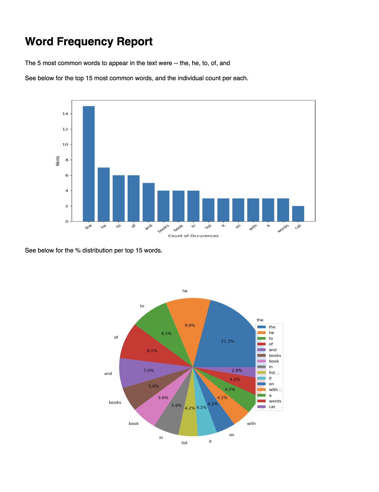

# Word Frequency Report
>This repository contains a python script to output a PDF report around frequency of words in a text exerpt. This will take a user's text file and return a report on the most common words, including a summary and visualizations for a handful of the most common words.

## Usage
1. Clone the repository to your local machine.
2. Update the text present in the _text.txt_ file so that the output is a more personalized report. See the sample text exerpt provided:  
  ```
  Lorem ipsum dolor sit amet, consectetur adipiscing elit. Quisque urna nulla, laoreet sodales maximus sit amet, tristique a libero. Donec condimentum eros venenatis pellentesque dapibus. Integer placerat maximus est non porttitor. Interdum et malesuada fames ac ante ipsum primis in faucibus. Nam ultrices neque id magna varius mattis. Aliquam et ipsum congue, iaculis eros at, viverra turpis. Praesent libero eros, ultricies nec tortor consectetur, facilisis porttitor lacus. Nam sed placerat urna. Praesent et ipsum nisl. Etiam ullamcorper vitae odio vel malesuada. Sed ut arcu feugiat, tincidunt nisi efficitur, condimentum lacus. Ut eu viverra augue. Aenean vulputate ut libero ac venenatis. Etiam vehicula nunc eros, nec ullamcorper tellus feugiat vitae. Aenean dictum scelerisque nisi ut finibus. Donec vel hendrerit elit.
  ```
3. Open terminal and move to the directory with the repository (using _cd path/to/repository_).
4. Run the python file _word_frequency.py_.
  ```
  python word_frequency.py
  ```
5. Check the directory for the PDF output.



## Dependencies
* pandas
* numpy
* matplotlib
* reportlab
