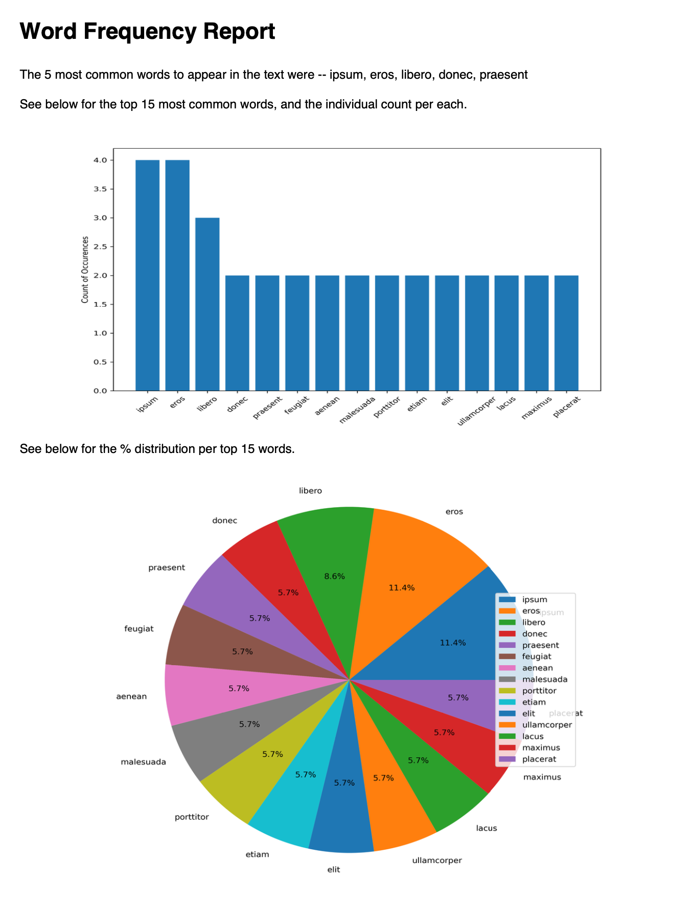

# Word Frequency Report
>This repository contains a python script to output a PDF report around frequency of words in a text exerpt. This will take a user's text file and return a report on the most common words, including a summary and visualizations for a handful of the most common words.

## Usage
1. Clone the repository to your local machine. 
2. Add a new text excerpt to a _.txt_ file. 
3. Open terminal and move to the directory with the repository (using _cd path/to/repository_).Run the following command to execute the python file:
```
python word_frequency.py text.txt 4
```
* The first section contains the python script
* The second section is the first argument, containing the .txt file
* The last section is the argument for minimum characters, meaning the min value to qualify for analysis
4. After the python script finishes, you will have a PDF report created. See below for the sample PDF output.
we used this excerpt with 4 minimum character to qualify:
```
Lorem ipsum dolor sit amet, consectetur adipiscing elit. Quisque urna nulla, laoreet sodales maximus sit amet, tristique a libero. Donec condimentum eros venenatis pellentesque dapibus. Integer placerat maximus est non porttitor. Interdum et malesuada fames ac ante ipsum primis in faucibus. Nam ultrices neque id magna varius mattis. Aliquam et ipsum congue, iaculis eros at, viverra turpis. Praesent libero eros, ultricies nec tortor consectetur, facilisis porttitor lacus. Nam sed placerat urna. Praesent et ipsum nisl. Etiam ullamcorper vitae odio vel malesuada. Sed ut arcu feugiat, tincidunt nisi efficitur, condimentum lacus. Ut eu viverra augue. Aenean vulputate ut libero ac venenatis. Etiam vehicula nunc eros, nec ullamcorper tellus feugiat vitae. Aenean dictum scelerisque nisi ut finibus. Donec vel hendrerit elit.

```


## Dependencies
* pandas
* numpy
* matplotlib
* reportlab
